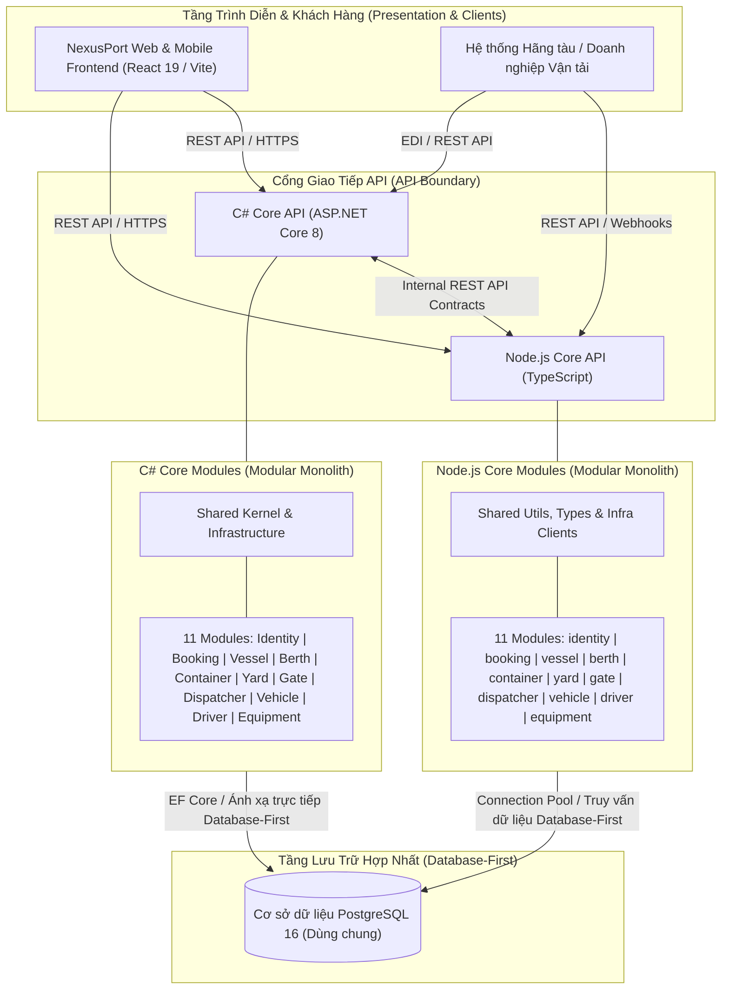

# ⚓ NexusPort Backend - Hệ Thống Quản Lý Cảng Biển & Terminal Container Thông Minh

## 1. 📌 Tổng quan (Overview)

**NexusPort** là nền tảng số hóa và quản lý vận hành cảng biển & bãi container thông minh (Terminal Operating System - TOS) đạt tiêu chuẩn doanh nghiệp. Hệ thống được thiết kế dựa trên quy trình nghiệp vụ thực tế tại các cảng container hiện đại, hỗ trợ toàn diện từ khâu tiếp nhận lịch tàu, quy hoạch cầu bến, bốc dỡ hàng hóa, quản lý bãi chứa container 3D, tự động hóa cổng cảng (Gate-In / Gate-Out), điều phối phương tiện nội bộ đến tích hợp với các công ty vận tải bên ngoài.

Backend của NexusPort được xây dựng theo mô hình **Kiến trúc Phân tán Đa Lõi Modular (Distributed Modular Backend Architecture)** kết hợp hai nền tảng công nghệ chủ đạo: **C# / ASP.NET Core (.NET 8)** và **Node.js / TypeScript**. Cả hai lõi đều tuân thủ mô hình **Database-First**, kết nối trực tiếp vào cơ sở dữ liệu PostgreSQL đã được thiết kế chuẩn mực và tổ chức theo nguyên lý **Modular Monolith** & **Domain-Driven Design (DDD)**.

---

## 2. 🎯 Mục tiêu hệ thống (System Objectives)

- **Tự động hóa luồng vận hành toàn diện**: Số hóa toàn bộ chu trình container từ khi tàu cập cảng (xếp dỡ tại cầu tàu), lưu bãi (xếp tầng, đảo chuyển) đến khi giao nhận qua cổng kiểm soát.
- **Điều phối thời gian thực**: Đồng bộ hóa hoạt động giữa các bộ phận vận hành cảng (điều độ tàu, điều độ bãi, giám sát cổng, lái xe nâng/xe kéo) và các doanh nghiệp vận tải.
- **Tối ưu hóa tài nguyên cảng**: Tối đa hóa công suất khai thác cầu bến (Berth), diện tích bãi (Yard Block) và phương tiện nâng hạ (Cẩu bờ STS, Cẩu bãi RTG, Xe nâng), giảm thiểu thời gian chờ và đảo chuyển container thừa.
- **Mô hình Database-First rõ ràng**: Cấu trúc bảng và quan hệ cơ sở dữ liệu được quy hoạch thiết kế chuẩn hóa trước (Database-First), giúp cả hai nền tảng C# và Node.js dễ dàng ánh xạ và truy xuất trực tiếp.
- **Linh hoạt trong kiến trúc & phân chia công việc**: Kiến trúc phân tán đa lõi cho phép phân bổ module linh hoạt theo năng lực đội ngũ và yêu cầu từng sprint, không ràng buộc cứng module vào một ngôn ngữ duy nhất.

---

## 3. 🏛️ Kiến trúc Backend (Backend Architecture)

Hệ thống tuân thủ mô hình **Distributed Modular Backend Architecture with two Modular Monolith Cores (Database-First)**.

```
                           +-------------------------------+
                           |      Frontend Client App      |
                           +---------------+---------------+
                                           |
                                   (HTTP / REST APIs)
                                           |
                    +----------------------+----------------------+
                    |                                             |
                    v                                             v
        +-----------------------+                     +-----------------------+
        |        C# Core        |                     |      Node.js Core     |
        |   (Modular Monolith)  |<--- (REST APIs) --->|   (Modular Monolith)  |
        |     ASP.NET Core 8    |                     |  Node.js / TypeScript |
        +-----------+-----------+                     +-----------+-----------+
                    |                                             |
                    |           +---------------------+           |
                    +---------->| PostgreSQL Database |<----------+
                                | (Database-First DB) |
                                +---------------------+
```

### Các nguyên tắc kiến trúc cốt lõi:
1. **Hai lõi Modular Monolith độc lập**: Cả C# Core và Node.js Core đều được tổ chức thành các phân hệ nghiệp vụ độc lập, phân tầng rõ ràng theo chuẩn Domain, Application, Infrastructure, và Presentation.
2. **Quyền sở hữu Module linh hoạt (Dynamic Module Ownership)**: Cả C# và Node.js đều có thể hiện thực hóa và mở rộng **bất kỳ phân hệ nghiệp vụ nào** (Booking, Container, Yard, Dispatcher, Vehicle,...). Việc phân chia module do kế hoạch sprint và yêu cầu kỹ thuật quyết định, không cố định theo ngôn ngữ lập trình.
3. **Giao tiếp liên lõi qua REST API**: Khi một tiến trình nghiệp vụ cần dữ liệu hoặc dịch vụ từ lõi khác, việc tương tác được thực hiện trực tiếp thông qua hợp đồng RESTful API đã được chuẩn hóa.
4. **Mô hình Database-First dùng chung**: Toàn bộ hệ thống kết nối vào **một cơ sở dữ liệu PostgreSQL duy nhất**. Cấu trúc bảng được khởi tạo sẵn trong Database, C# và Node.js trực tiếp ánh xạ tới các bảng tương ứng.

---

## 4. 📊 Sơ đồ kiến trúc tổng thể (Architecture Diagram)



---

## 5. 🛠️ Công nghệ sử dụng (Technology Stack)

| Thành phần | Công nghệ | Phiên bản / Công cụ | Mục đích sử dụng |
| :--- | :--- | :--- | :--- |
| **C# Core** | C# / ASP.NET Core | .NET 8 (LTS) | Lõi xử lý nghiệp vụ chính, giao dịch và phân hệ cốt lõi |
| **C# ORM & Data** | Entity Framework Core | EF Core 8 (Npgsql) | Ánh xạ thực thể Database-First và truy vấn dữ liệu |
| **Node.js Core** | Node.js / TypeScript | Node.js v20+, TypeScript 5+ | Lõi xử lý I/O cao, micro-services, APIs linh hoạt |
| **Node.js Framework** | Express.js | Express 4.x / Zod | Xây dựng REST API, routing, request validation |
| **Cơ sở dữ liệu** | PostgreSQL | 16 / 18 (Alpine/Local) | Cơ sở dữ liệu quan hệ lưu trữ tập trung (Database-First) |
| **Tài liệu API** | OpenAPI (Swagger) | Swagger UI / OpenAPI 3.0 | Định nghĩa API Contract và giao diện thử nghiệm API tương tác |
| **Container hóa** | Docker & Docker Compose | Docker Engine 24+, Compose v2 | Đóng gói môi trường phát triển đồng nhất |

---

## 6. 🧱 Cấu trúc Modular Monolith (Modular Monolith Structure)

Mỗi module trong cả hai lõi C# và Node.js đều được tổ chức thành 4 phân tầng kiến trúc độc lập theo nguyên lý Domain-Driven Design (DDD):

```
ModuleName/
├── Domain/           # Tầng nghiệp vụ cốt lõi
├── Application/      # Tầng trường hợp sử dụng (Use Cases)
├── Infrastructure/   # Tầng truy xuất dữ liệu & dịch vụ ngoài
└── Presentation/     # Tầng giao tiếp API / Controller
```

---

## 7. 📁 Cấu trúc thư mục Backend (Backend Directory Structure)

```
nexusport-backend/
│
├── csharp-core/                              # Lõi C# / ASP.NET Core 8 Modular Monolith
│   ├── NexusPort.sln                         # Solution tập hợp toàn bộ project
│   ├── src/
│   │   ├── NexusPort.Api/                    # API Host, Middleware & Cấu hình Dependency Injection
│   │   │   ├── Controllers/                  # Base API và Health Controllers
│   │   │   ├── Middleware/                   # Xử lý Exception toàn cục, Request Logging
│   │   │   ├── Extensions/                   # Extension methods cấu hình DI & Swagger
│   │   │   ├── appsettings.json              # File cấu hình môi trường
│   │   │   ├── Dockerfile                    # Dockerfile đóng gói C# Core API
│   │   │   └── Program.cs                    # Điểm khởi chạy ứng dụng
│   │   │
│   │   ├── Modules/                          # 11 Phân hệ nghiệp vụ cảng biển (DDD)
│   │   │   ├── Identity/                     # Phân hệ quản lý tài khoản & phân quyền
│   │   │   ├── Booking/                      # Phân hệ quản lý đơn đặt chỗ & e-DO
│   │   │   ├── Vessel/                       # Phân hệ quản lý tàu mẹ & lịch trình cập cảng
│   │   │   ├── Berth/                        # Phân hệ kế hoạch cầu bến & bốc dỡ
│   │   │   ├── Container/                    # Phân hệ quản lý thông tin & vòng đời container
│   │   │   ├── Yard/                         # Phân hệ quy hoạch & quản lý bãi container
│   │   │   ├── Gate/                         # Phân hệ kiểm soát cổng tự động & OCR
│   │   │   ├── Dispatcher/                   # Phân hệ điều phối lệnh công việc nội bộ
│   │   │   ├── Vehicle/                      # Phân hệ quản lý đội xe cảng & xe ngoài
│   │   │   ├── Driver/                       # Phân hệ quản lý thông tin tài xế & ca trực
│   │   │   └── Equipment/                    # Phân hệ quản lý cẩu bờ, cẩu bãi & xe nâng
│   │   │
│   │   ├── Shared/                           # Kernel & thành phần dùng chung
│   │   │   ├── Kernel/                       # BaseEntity, ValueObject, IDomainEvent, IAggregateRoot
│   │   │   ├── Exceptions/                   # Các lớp Exception chuẩn hóa
│   │   │   ├── Results/                      # Result<T>, PagedResult<T>, Error
│   │   │   └── Constants/                    # Hằng số hệ thống, định nghĩa Role, Error Codes
│   │   │
│   │   └── Infrastructure/                   # Hạ tầng dùng chung
│   │       ├── Database/                     # AppDbContext, Entity Configurations (Database-First)
│   │       ├── Authentication/               # JWT Service, CurrentUser Context
│   │       └── ExternalServices/             # Dịch vụ gửi email, Message Broker
│
├── node-core/                                # Lõi Node.js / TypeScript Modular Monolith
│   ├── src/
│   │   ├── api/                              # Tầng API Gateway nội bộ
│   │   │   ├── controllers/                  # Health và Shared Controllers
│   │   │   ├── routes/                       # Router tập trung gom toàn bộ 11 module
│   │   │   ├── middleware/                   # Authentication, Request Logger, Error Handler
│   │   │   └── app.ts                        # Khởi tạo Express App
│   │   │
│   │   ├── modules/                          # 11 Phân hệ nghiệp vụ tương ứng
│   │   │   ├── identity/                     # domain, application, infrastructure, presentation
│   │   │   ├── booking/                      # domain, application, infrastructure, presentation
│   │   │   ├── vessel/                       # domain, application, infrastructure, presentation
│   │   │   ├── berth/                        # domain, application, infrastructure, presentation
│   │   │   ├── container/                    # domain, application, infrastructure, presentation
│   │   │   ├── yard/                         # domain, application, infrastructure, presentation
│   │   │   ├── gate/                         # domain, application, infrastructure, presentation
│   │   │   ├── dispatcher/                   # domain, application, infrastructure, presentation
│   │   │   ├── vehicle/                      # domain, application, infrastructure, presentation
│   │   │   ├── driver/                       # domain, application, infrastructure, presentation
│   │   │   └── equipment/                    # domain, application, infrastructure, presentation
│   │   │
│   │   ├── shared/                           # Tiện ích và kiểu dữ liệu dùng chung
│   │   │   ├── constants/                    # Hằng số, mã HTTP status, tên Role
│   │   │   ├── errors/                       # AppError và cây kế thừa lỗi
│   │   │   ├── types/                        # ApiResponse, Pagination, Interfaces chung
│   │   │   └── utils/                        # Logger có cấu trúc, hàm format response
│   │   │
│   │   ├── infrastructure/                   # Kết nối cơ sở dữ liệu & hạ tầng
│   │   │   ├── database/                     # PostgreSQL Connection Pool Client
│   │   │   ├── external-services/            # Dịch vụ gửi Mailer
│   │   │   └── clients/                      # Client kết nối Redis, RabbitMQ
│   │   │
│   │   └── server.ts                         # Điểm khởi chạy server Node.js
│   │
│   ├── package.json                          # Khai báo thư viện & npm scripts
│   ├── tsconfig.json                         # Cấu hình TypeScript compiler & Path Aliases
│   └── Dockerfile                            # Dockerfile đóng gói Node Core Service
│
├── docker-compose.yml                        # Cấu hình khởi chạy PostgreSQL, Redis, RabbitMQ, C# API, Node Core
├── .env.example                              # Mẫu khai báo biến môi trường
├── .gitignore                                # Cấu hình loại trừ file cho Git
└── README.md                                 # Tài liệu kỹ thuật dự án
```

---

## 8. 🏢 Các phân hệ nghiệp vụ (Business Modules)

Hệ thống bao gồm 11 phân hệ nghiệp vụ cốt lõi. **Cả C# và Node.js đều có khả năng hiện thực hóa bất kỳ module nào. Quyền sở hữu module được quyết định theo phân công sprint/nhóm thay vì ngôn ngữ lập trình.**

| Module | Phạm vi & Chức năng | Khả năng nghiệp vụ chính |
| :--- | :--- | :--- |
| **Identity** | Xác thực & Phân quyền RBAC | Quản lý người dùng, phân quyền theo vai trò (Admin, Planner, Officer, Driver,...), cấp phát và xác thực JWT token. |
| **Booking** | Đặt chỗ & Quản lý Đơn hàng | Tiếp nhận đơn đặt chỗ xuất/nhập, kiểm tra lệnh giao hàng điện tử (e-DO), theo dõi hạn ngạch container của hãng tàu. |
| **Vessel** | Lịch trình & Thông số Tàu | Quản lý hồ sơ tàu mẹ (IMO, mớn nước, chiều dài, sức chở TEU), kế hoạch chuyến tàu (ETA, ETD, ATA, ATD). |
| **Berth** | Quy hoạch & Khai thác Cầu bến | Phân bổ vị trí neo đậu tại cầu tàu (Berth Planning), chia đoạn bến (Bollard), điều độ cẩu bờ Ship-to-Shore (STS). |
| **Container** | Vòng đời & Trạng thái Container | Kiểm chuẩn số container ISO 6346, phân loại (hàng khô, hàng lạnh, hàng nguy hiểm), tình trạng vỏ cont và số seal. |
| **Yard** | Quản lý Bãi Container | Sơ đồ bãi tọa độ 3D/2D (Block, Bay, Row, Tier), lập kế hoạch hạ bãi tự động và tối ưu đảo chuyển. |
| **Gate** | Tự động hóa Cổng cảng | Tích hợp camera OCR nhận diện biển số & mã cont, kiểm tra tải trọng xe qua trạm cân, in phiếu EIR, điều khiển barrier. |
| **Dispatcher** | Điều phối Lệnh Công việc | Tự động tạo và phân phối lệnh công việc (Work Order) thời gian thực cho xe đầu kéo nội bộ và xe nâng bãi. |
| **Vehicle** | Quản lý Phương tiện Vận tải | Theo dõi đội xe đầu kéo nội bộ cảng (Yard Truck), rơ-moóc chuyên dụng (Chassis), xe vận tải bên ngoài và xe tự hành (AGV). |
| **Driver** | Quản lý Tài xế & Vận chuyển | Hồ sơ tài xế, xác minh giấy phép lái xe, quản lý ca trực, cổng thông tin tài xế nhận lệnh giao nhận. |
| **Equipment** | Thiết bị & Phương tiện Nâng hạ | Giám sát trạng thái cẩu bờ (STS), cẩu bãi (RTG/RMG), xe nâng chụp container (Reach Stacker) và nhật ký bảo dưỡng. |

---

## 9. ⚙️ C# Core (.NET 8)

Lõi **C# Core** được xây dựng trên nền tảng **ASP.NET Core 8** và **Entity Framework Core 8**.

- **Mô hình Database-First**: Kết nối và ánh xạ trực tiếp tới các bảng đã tạo sẵn trong PostgreSQL database.
- **Tổ chức Module**: Mỗi module là một Class Library độc lập (`NexusPort.Modules.*`), liên kết chặt chẽ qua `NexusPort.Shared` và `NexusPort.Infrastructure`.
- **Đặc tính kỹ thuật**: Hiệu năng xử lý giao dịch cao, kiểm soát kiểu dữ liệu nghiêm ngặt ở compile-time, Dependency Injection chuẩn hóa và tích hợp sẵn Swagger UI.

---

## 10. ⚡ Node.js Core (TypeScript)

Lõi **Node.js Core** được xây dựng với **Node.js**, **TypeScript** và **Express.js**.

- **Mô hình truy xuất Database-First**: Tương tác với cơ sở dữ liệu PostgreSQL dùng chung thông qua connection pool tối ưu (`pg`), truy xuất trực tiếp các bảng nghiệp vụ.
- **Path Aliases**: Sử dụng path mapping tiện lợi (`@api/*`, `@modules/*`, `@shared/*`, `@infrastructure/*`) giúp mã nguồn trong sáng, dễ mở rộng.
- **Đặc tính kỹ thuật**: Xử lý I/O không nghẽn (Non-blocking I/O), phát triển tính năng nhanh chóng, tiêu tốn ít tài nguyên và xác thực dữ liệu đầu vào mạnh mẽ qua Zod.

---

## 11. 🔄 Giao tiếp giữa C# và Node.js (C#–Node.js Communication)

Khi một quy trình nghiệp vụ cần phối hợp dữ liệu giữa hai lõi, việc giao tiếp diễn ra trực tiếp thông qua **giao thức RESTful HTTP APIs** theo chuẩn hợp đồng đã thống nhất.

---

## 12. 🗄️ Kiến trúc Cơ sở dữ liệu (Database Architecture - Database-First)

Hệ thống sử dụng **MỘT cơ sở dữ liệu PostgreSQL dùng chung duy nhất** theo hướng tiếp cận **Database-First**.

```
                   +-----------------------+
                   |        C# Core        |
                   | (Ánh xạ Database-First)|
                   +-----------+-----------+
                               |
                               | (Đọc / Ghi trực tiếp các bảng)
                               v
               +-------------------------------+
               |     PostgreSQL Database       |
               |     (Duy nhất 1 Database)     |
               +-------------------------------+
                               ^
                               | (Đọc / Ghi qua Connection Pool)
                               |
                   +-----------+-----------+
                   |     Node.js Core      |
                   | (Truy vấn & Xử lý DTO)|
                   +-----------------------+
```

### Danh sách 11 bảng nghiệp vụ đã thiết lập sẵn trong Database:
1. `Users` - Tài khoản và phân quyền người dùng
2. `Bookings` - Đơn đặt chỗ bốc dỡ hàng
3. `Vessels` - Tàu mẹ và thông số kỹ thuật
4. `Berths` - Cầu bến và vị trí neo đậu
5. `Containers` - Quản lý thông tin container
6. `YardBlocks` - Bãi container và vị trí tọa độ
7. `GateTransactions` - Giao dịch cổng kiểm soát
8. `WorkOrders` - Lệnh công việc điều phối
9. `Vehicles` - Xe đầu kéo và rơ-moóc
10. `Drivers` - Danh sách tài xế
11. `Equipments` - Thiết bị cẩu bờ, cẩu bãi, xe nâng

---

## 13. 📑 Chiến lược Entity và DTO (Entity and DTO Strategy)

- **C# Core**: Ánh xạ các thực thể trực tiếp từ các bảng trong database.
- **Node.js Core**: Định nghĩa các DTOs, Interfaces và Types đại diện cho các bảng dữ liệu để xử lý logic và phục vụ API.

---

## 14. 📜 Hợp đồng API (API Contract)

Toàn bộ API được thiết kế theo chuẩn **RESTful API** với định dạng chuẩn hóa:

| Phương thức | Endpoint | Mô tả chức năng |
| :--- | :--- | :--- |
| `GET` | `/api/v1/containers` | Lấy danh sách container có phân trang và bộ lọc |
| `GET` | `/api/v1/containers/{id}` | Lấy chi tiết thông tin và vị trí của một container |
| `POST` | `/api/v1/bookings` | Tạo mới đơn đặt chỗ container |
| `PUT` | `/api/v1/bookings/{id}` | Cập nhật thông tin đơn booking |
| `DELETE` | `/api/v1/bookings/{id}` | Hủy đơn booking |
| `GET` | `/api/v1/yard/blocks` | Lấy sơ đồ các Block bãi và tỷ lệ lấp đầy |
| `POST` | `/api/v1/gate/check-in` | Xử lý thủ tục xe qua cổng với dữ liệu OCR |
| `GET` | `/api/v1/dispatcher/jobs` | Lấy danh sách lệnh công việc điều phối đang hoạt động |

---

## 15. 🌿 Chiến lược phân nhánh Git (Git Branching Strategy)

```
main (Nhánh Release / Ổn định / Demo)
  └── develop (Nhánh Tích hợp chính)
        ├── feature/booking-create
        ├── feature/container-management
        ├── feature/yard-management
        ├── feature/dispatcher-task
        └── fix/booking-validation
```

---

## 16. ✍️ Quy chuẩn đặt tên Commit (Commit Convention)

```
<type>(<scope>): <description>
```
Hỗ trợ các types: `feat`, `fix`, `refactor`, `docs`, `test`, `chore`, `build`, `perf`.

---

## 17. 💻 Hướng dẫn chạy môi trường Local (Local Development)

### 1. Khởi chạy C# Core API (.NET 8)

```bash
cd csharp-core/src/NexusPort.Api
dotnet restore
dotnet build
dotnet run
```
- API Base URL: `http://localhost:5000`
- Swagger UI tài liệu API: `http://localhost:5000/swagger`

### 2. Khởi chạy Node.js Core Service (TypeScript)

```bash
cd node-core
npm install
npm run dev
```
- Node Service Base URL: `http://localhost:4000`
- Health Check: `http://localhost:4000/api/v1/health`

---

## 18. 📄 Bản quyền & Giấy phép (License)

Dự án này được phát triển trong khuôn khổ Đề án Hệ thống Quản trị Cảng biển Thông minh **NexusPort**. Mọi quyền được bảo lưu.
